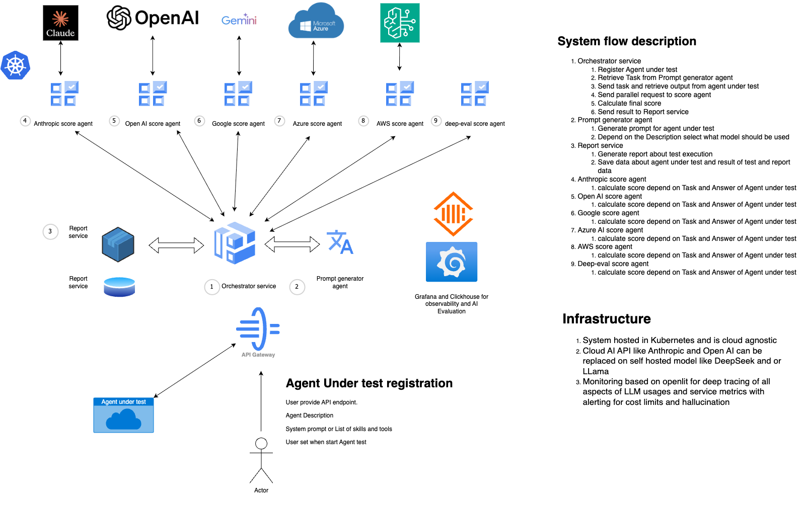

# AI Testing Agents Framework

A comprehensive framework for testing and evaluating AI agents through automated prompt optimization, agent testing, and response scoring. This system provides a standardized approach to assess AI agent performance across multiple criteria.

## 🏗️ Architecture Overview

The AI Testing Agents Framework consists of several interconnected services that work together to provide a complete testing pipeline:



The framework orchestrates a complete testing workflow:
- **Orchestrator Agent** (Port 8002): Central coordination service
- **Prompt Optimizer** (Port 8001): Multi-agent system for prompt optimization
- **Scoring Agent** (Port 8000): AI-powered response evaluation
- **Agent Under Test** (Port 8003): BDD scenario generator being tested

## 🚀 Quick Start

### Prerequisites

- Python 3.9+
- Docker and Docker Compose (optional)
- OpenAI API key (for scoring service)

### Installation

1. **Clone the repository**
   ```bash
   git clone <repository-url>
   cd ai-testing-agents
   ```

2. **Set up environment variables**
   ```bash
   # Create .env file in root directory
   cp .env.example .env
   # Edit .env and add your OpenAI API key
   ```

3. **Start all services with Docker Compose**
   ```bash
   docker-compose up -d
   ```

   Or start services individually:

   ```bash
   # Start scoring service
   cd scoring_agents/openai_scoring_agent
   docker-compose up -d

   # Start prompt optimizer
   cd task_agent
   python run.py

   # Start orchestrator
   cd core_service
   python main.py

   # Start agent under test
   cd agent_under_test
   python -m uvicorn app.main:app --host 0.0.0.0 --port 8003
   ```

## 📋 Components

### 1. Core Service (Orchestrator Agent)
**Location:** `core_service/`
**Port:** 8002

The central coordination service that manages the entire testing pipeline:
- Registers and validates AI agents
- Coordinates prompt optimization
- Executes agent testing
- Manages response scoring
- Provides batch testing capabilities

**Key Features:**
- Agent registration and validation
- Automated prompt optimization
- Parallel test execution
- Health monitoring
- Comprehensive error handling

### 2. Agent Under Test (BDD Generator)
**Location:** `agent_under_test/`
**Port:** 8003

An AI-powered agent that generates Behavior-Driven Development (BDD) scenarios from natural language requirements:
- Converts requirements to Given-When-Then format
- Supports multiple output formats (Gherkin, JSON)
- Generates negative scenarios
- Includes examples tables

**Key Features:**
- Natural language processing
- BDD scenario generation
- Quality validation
- RESTful API interface

### 3. Scoring Agents
**Location:** `scoring_agents/`
**Port:** 8000

AI-powered scoring services that evaluate agent responses:
- Single and batch scoring capabilities
- Configurable scoring criteria
- Detailed reasoning for scores
- Rate limiting and error handling

**Available Scoring Agents:**
- **OpenAI Scoring Agent:** Uses OpenAI models for evaluation
- **Anthropic Scoring Agent:** Uses Anthropic models for evaluation

### 4. Task Agent (Prompt Optimizer)
**Location:** `task_agent/`
**Port:** 8001

A multi-agent system that optimizes prompts for better results:
- Analyzes prompt structure and clarity
- Applies industry best practices
- Validates optimized prompts
- Provides detailed optimization analysis

**Key Features:**
- Multi-agent architecture
- Best practice application
- Quality validation
- Memory tracking

### 5. Report Service
**Location:** `report_service/`
**Status:** In development

Future service for generating comprehensive test reports and analytics.

## 🔧 Configuration

### Environment Variables

Create a `.env` file in the root directory:

```bash
# OpenAI Configuration
OPENAI_API_KEY=your_openai_api_key_here
OPENAI_MODEL=gpt-4
OPENAI_MAX_TOKENS=2000
OPENAI_TEMPERATURE=0.0

# Service URLs
OPTIMIZER_URL=http://localhost:8001
SCORER_URL=http://localhost:8000
ORCHESTRATOR_URL=http://localhost:8002

# Logging
LOG_LEVEL=INFO

# Scoring Configuration
DEFAULT_SCORING_THRESHOLD=6.0
DEFAULT_SCORING_CRITERIA=accuracy,relevance,clarity,completeness
```

### Service Configuration

Each service has its own configuration file:
- `core_service/config.yaml` - Orchestrator configuration
- `scoring_agents/openai_scoring_agent/.env` - Scoring service configuration
- `task_agent/.env` - Prompt optimizer configuration

## 📚 API Usage

### 1. Register an Agent

```bash
curl -X POST http://localhost:8002/register-agent \
  -H "Content-Type: application/json" \
  -d '{
    "agent_endpoint": "http://localhost:8003/bdd-from-text",
    "agent_description": "BDD Agent that creates BDD scenarios from text",
    "system_prompt": "You are a BDD agent that converts text descriptions into BDD scenarios using Gherkin syntax.",
    "skills_and_tools": ["text_analysis", "gherkin_generation", "scenario_creation"],
    "test_criteria": ["accuracy", "relevance", "clarity", "completeness"],
    "scoring_threshold": 6.0
  }'
```

### 2. Test an Agent

```bash
curl -X POST http://localhost:8002/test-agent \
  -H "Content-Type: application/json" \
  -d '{
    "agent_endpoint": "http://localhost:8003/bdd-from-text",
    "test_prompt": "Create a BDD scenario for user login functionality",
    "test_criteria": ["accuracy", "relevance", "clarity", "completeness"],
    "scoring_threshold": 6.0,
    "optimization_context": {
      "language": "English",
      "complexity": "intermediate",
      "target_audience": "developers"
    }
  }'
```

### 3. Batch Testing

```bash
curl -X POST http://localhost:8002/test-batch \
  -H "Content-Type: application/json" \
  -d '{
    "tests": [
      {
        "agent_endpoint": "http://localhost:8003/bdd-from-text",
        "test_prompt": "Create a BDD scenario for user login",
        "test_criteria": ["accuracy", "relevance"]
      },
      {
        "agent_endpoint": "http://localhost:8003/bdd-from-text",
        "test_prompt": "Create a BDD scenario for payment processing",
        "test_criteria": ["accuracy", "clarity", "completeness"]
      }
    ],
    "parallel_execution": true
  }'
```

### 4. Direct Agent Testing

```bash
curl -X POST http://localhost:8003/bdd-from-text \
  -H "Content-Type: application/json" \
  -d '{
    "requirements": "As a user, I should be able to log into the system. When I enter valid credentials, the system should authenticate me and redirect me to the dashboard.",
    "options": {
      "include_negative_scenarios": true,
      "output_format": "both",
      "max_scenarios_per_requirement": 5,
      "include_examples": true
    }
  }'
```

### 5. Prompt Optimization

```bash
curl -X POST http://localhost:8001/optimize \
  -H "Content-Type: application/json" \
  -d '{
    "prompt": "Write a function to calculate fibonacci numbers",
    "context": {
      "language": "python",
      "complexity": "medium"
    }
  }'
```

### 6. Response Scoring

```bash
curl -X POST http://localhost:8000/score \
  -H "Content-Type: application/json" \
  -d '{
    "response": "The AI response to evaluate",
    "criteria": ["accuracy", "relevance", "clarity"],
    "context": "Additional context for scoring"
  }'
```

## 🧪 Testing

### Run All Tests

```bash
# Core service tests
cd core_service
pytest tests/

# Agent under test
cd agent_under_test
pytest tests/

# Scoring agent tests
cd scoring_agents/openai_scoring_agent
pytest tests/

# Task agent tests
cd task_agent
pytest tests/
```

### Postman Collection

Use the provided Postman collection for testing:
- File: `ai-testing-demo.postman_collection.json`
- Import into Postman for easy API testing

## 📊 Monitoring

### Health Checks

```bash
# Orchestrator health
curl http://localhost:8002/health

# Scoring service health
curl http://localhost:8000/health

# Agent under test health
curl http://localhost:8003/health

# Prompt optimizer health
curl http://localhost:8001/health
```

### Service Status

```bash
# Check all services
docker-compose ps

# View logs
docker-compose logs -f

# Individual service logs
docker-compose logs -f orchestrator
docker-compose logs -f scoring-agent
docker-compose logs -f prompt-optimizer
docker-compose logs -f agent-under-test
```

## 🐳 Docker Deployment

### Using Docker Compose

```bash
# Start all services
docker-compose up -d

# Stop all services
docker-compose down

# Rebuild and start
docker-compose up --build -d

# View logs
docker-compose logs -f
```

### Individual Docker Services

```bash
# Build and run scoring service
cd scoring_agents/openai_scoring_agent
docker-compose up -d

# Build and run agent under test
cd agent_under_test
docker-compose up -d

# Build and run core service
cd core_service
docker-compose up -d
```

## 🔍 Development

### Project Structure

```
ai-testing-agents/
├── core_service/           # Orchestrator agent
├── agent_under_test/       # BDD generator agent
├── scoring_agents/         # Scoring services
│   ├── openai_scoring_agent/
│   └── antropic_scoring_agent/
├── task_agent/             # Prompt optimizer
├── report_service/         # Future reporting service
├── ai-testing-demo.postman_collection.json
└── README.md
```

### Development Setup

1. **Create virtual environments for each service**
   ```bash
   # Core service
   cd core_service
   python -m venv venv
   source venv/bin/activate
   pip install -r requirements.txt

   # Agent under test
   cd agent_under_test
   python -m venv venv
   source venv/bin/activate
   pip install -r requirements.txt

   # Scoring agent
   cd scoring_agents/openai_scoring_agent
   python -m venv venv
   source venv/bin/activate
   pip install -r requirements.txt

   # Task agent
   cd task_agent
   python -m venv venv
   source venv/bin/activate
   pip install -r requirements.txt
   ```

2. **Run services in development mode**
   ```bash
   # Start each service in separate terminals
   cd core_service && python main.py
   cd agent_under_test && uvicorn app.main:app --reload --port 8003
   cd scoring_agents/openai_scoring_agent && python main.py
   cd task_agent && python run.py
   ```

## 📈 Performance

- **Response Time:** < 30 seconds for complete testing cycle
- **Throughput:** Supports up to 100 concurrent tests
- **Availability:** 99.5% uptime target
- **Memory Usage:** ~2GB RAM per service
- **CPU:** 4+ cores recommended per service

## 🔒 Security

- API key authentication
- Request validation and sanitization
- CORS configuration
- Comprehensive audit logging
- Rate limiting
- Non-root Docker containers

## 🤝 Contributing

1. Fork the repository
2. Create a feature branch
3. Make your changes
4. Add tests for new functionality
5. Run the test suite
6. Submit a pull request

### Code Style

```bash
# Format code
black .

# Lint code
flake8 .

# Type checking
mypy .
```

## 📄 License

This project is licensed under the MIT License - see the LICENSE file for details.

## 🆘 Support

For issues and questions:
1. Check the documentation in each service directory
2. Review existing issues
3. Create a new issue with detailed information
4. Include logs and error messages

## 🚀 Roadmap

- [ ] Enhanced NLP models for better entity extraction
- [ ] Support for multiple languages
- [ ] Integration with popular test frameworks
- [ ] Web-based UI for non-technical users
- [ ] Batch processing for multiple requirements
- [ ] Custom scenario templates
- [ ] Integration with CI/CD pipelines
- [ ] Advanced analytics and reporting
- [ ] Multi-agent collaboration features
- [ ] Real-time monitoring dashboard 